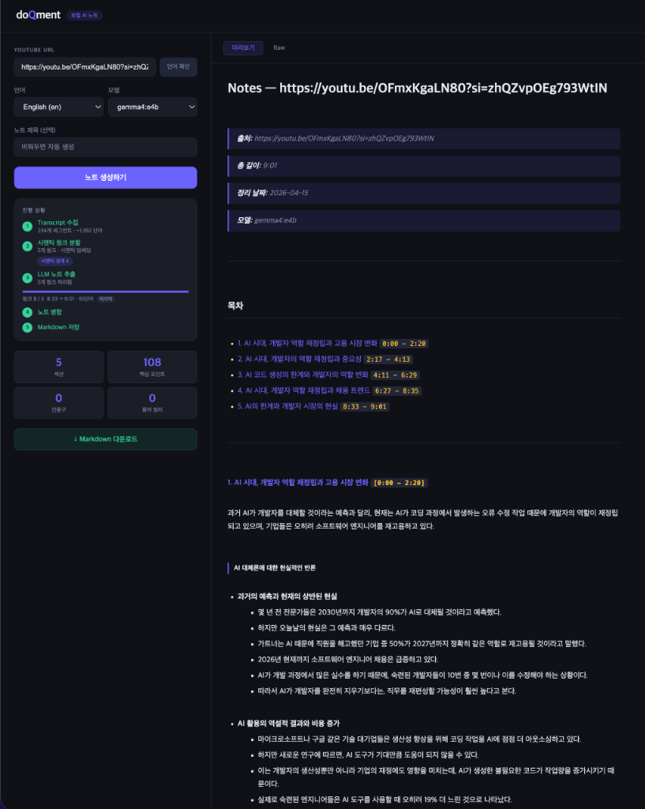

# doQment

> YouTube 영상을 **압축 없이**, 각 발화를 라인별로 충실하게 변환하는 로컬 AI 노트 생성기

[](https://www.python.org/)
[](https://ollama.com/)
[](https://fastapi.tiangolo.com/)
[](LICENSE)

---



---

## 소개

doQment는 YouTube URL 하나만 입력하면, 로컬 LLM(Gemma4)이 영상의 transcript를 읽고 **요약 없이 발화 전체를 한국어 상세 노트**로 변환해주는 도구입니다.

- **완전 로컬 실행** — API 키 불필요, 인터넷에 데이터 전송 없음
- **요약하지 않음** — 발표자가 말한 모든 내용을 1:1로 문장 변환
- **실시간 스트리밍** — SSE(Server-Sent Events)로 처리 과정을 실시간 확인
- **Markdown 출력** — 목차, 섹션 헤더, 계층형 불릿 구조로 즉시 활용 가능

---

## 주요 기능

| 기능 | 설명 |
|------|------|
| 🎬 **YouTube Transcript 수집** | 수동 자막 우선, 없으면 자동 생성 자막 사용 |
| 🧠 **시맨틱 청킹** | `all-MiniLM-L6-v2` 임베딩 기반 주제 경계 감지 후 분할 |
| 📝 **LLM 노트 추출** | Ollama(Gemma4) 로컬 LLM으로 청크별 노트 추출 |
| 🔁 **자동 재시도** | JSON 파싱 실패 시 `repeat_penalty` 강화 후 최대 3회 재시도 |
| 📡 **실시간 스트리밍** | 각 처리 단계를 WebUI에 실시간으로 피드백 |
| 💾 **Markdown 저장** | `output/YYYY-MM-DD_제목.md` 형식으로 자동 저장 및 다운로드 |

---

## 요구 사항

- Python 3.11+
- [Ollama](https://ollama.com/) 설치 및 실행
- Gemma4 모델 (`ollama pull gemma4:e4b`)

---

## 설치 및 실행

```bash
# 1. 저장소 클론
git clone https://github.com/hyukjin-lee/doQment-ai.git
cd doQment-ai

# 2. 가상환경 생성
python3 -m venv .venv
source .venv/bin/activate

# 3. 패키지 설치
pip install -e ".[web]"

# 4. Ollama 모델 설치 (최초 1회)
ollama pull gemma4:e4b

# 5. 웹 UI 실행
python -m doqment.web
# → http://localhost:8000 브라우저에서 열기
```

### CLI로 사용하기

```bash
# 기본 사용
python -m doqment "https://www.youtube.com/watch?v=VIDEO_ID"

# 한국어 영상
python -m doqment "URL" --lang ko

# 노트 제목 지정
python -m doqment "URL" --title "내 노트 제목"

# 모델 변경
python -m doqment "URL" --model gemma4:4b
```

---

## 파이프라인 흐름

```
YouTube URL
  → Transcript 수집 (자동/수동 자막, 노이즈 제거)
  → 시맨틱 청킹 (임베딩 기반 주제 경계 감지)
  → LLM 노트 추출 (청크별 Gemma4 호출, 재시도 포함)
  → 청크 노트 병합
  → Markdown 렌더링 & 저장
```

---

## 프로젝트 구조

```
doQment/
├── doqment/
│   ├── cli.py          # CLI 진입점
│   ├── web.py          # FastAPI 웹 서버 (SSE 스트리밍)
│   ├── transcript.py   # YouTube transcript 수집
│   ├── chunker.py      # 시맨틱 임베딩 기반 청킹
│   ├── processor.py    # LLM 노트 추출 + 재시도
│   ├── aggregator.py   # 청크 병합
│   └── renderer.py     # Markdown 렌더링
├── prompts/
│   └── extract_notes.txt  # LLM 프롬프트 (수정으로 품질 개선)
├── static/
│   └── index.html      # 웹 UI (단일 파일)
├── output/             # 생성된 노트 저장 (git 제외)
└── docs/               # 문서 및 스크린샷
```

---

## 의존성

| 패키지 | 용도 |
|--------|------|
| `youtube-transcript-api` | YouTube 자막 수집 |
| `ollama` | 로컬 LLM 연동 |
| `sentence-transformers` | 시맨틱 청킹용 임베딩 모델 |
| `numpy` | 코사인 거리 계산 |
| `typer` + `rich` | CLI 인터페이스 |
| `fastapi` + `uvicorn` | 웹 서버 |
| `python-slugify` | 파일명 생성 |

---

## 알려진 제약

- Transcript가 비활성화된 영상은 처리 불가
- 1시간 영상 기준 약 10~20분 소요 (GPU 성능에 따라 다름)
- 첫 실행 시 임베딩 모델 자동 다운로드 (~90MB)

---

## License

MIT
